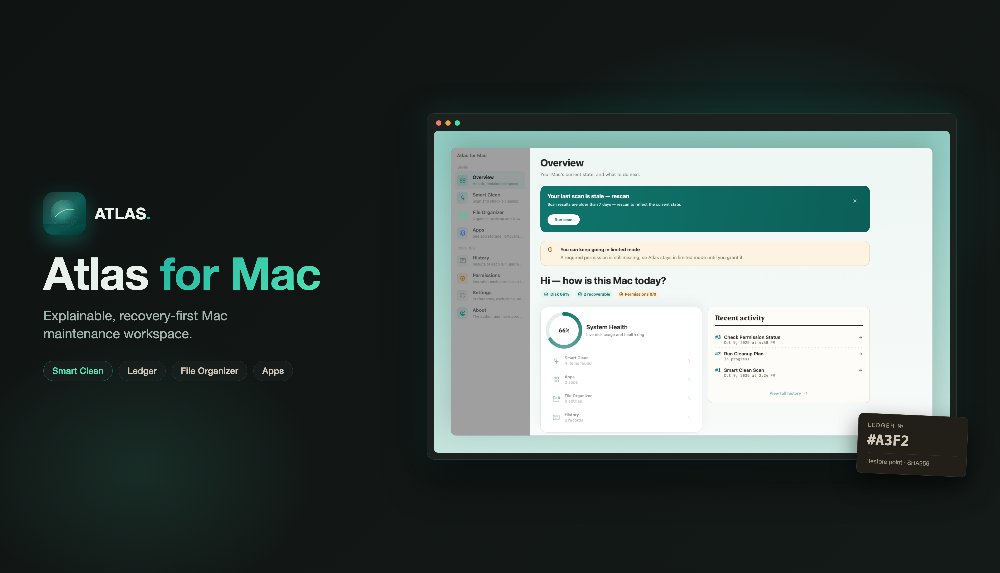
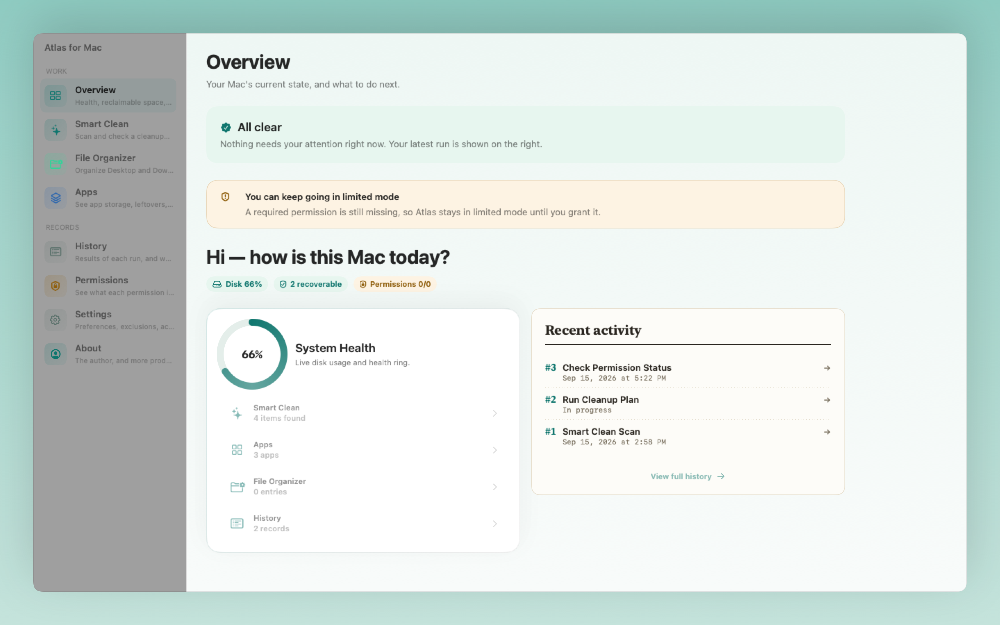
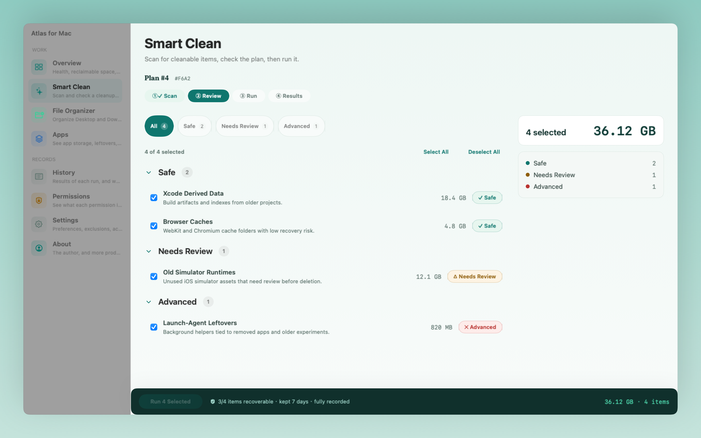
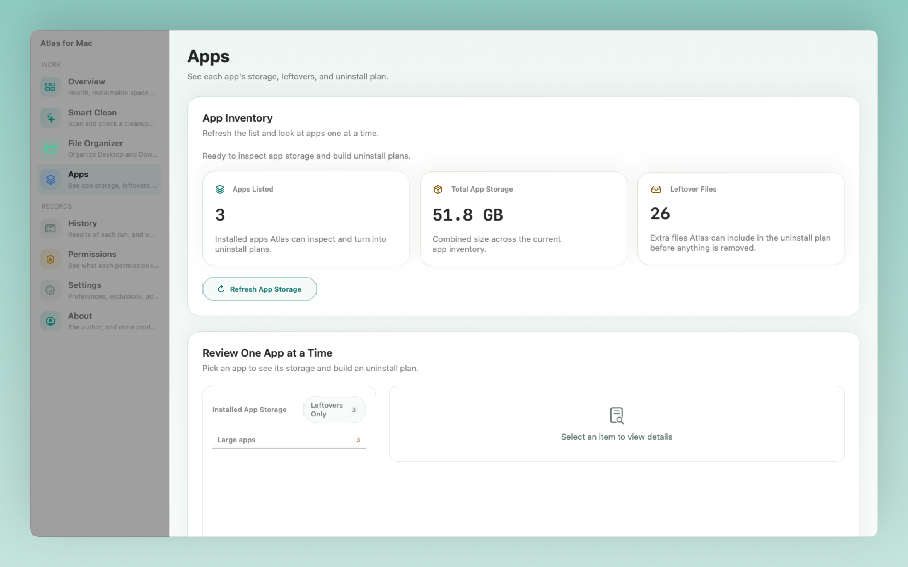
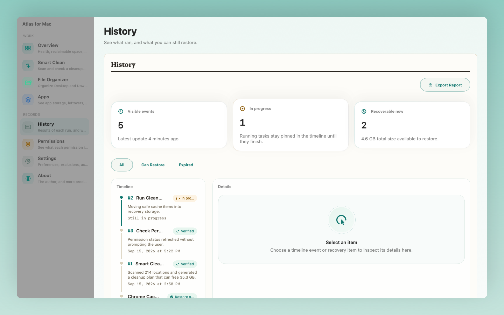
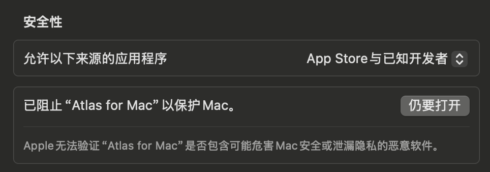

<div align="center">
  
</div>

<div align="center">
  <h1>Atlas for Mac</h1>
  <p><em>Explainable, recovery-first Mac maintenance workspace.</em></p>
  <p><strong>English</strong> | <a href="README.zh-CN.md">简体中文</a></p>
  <p>
    <a href="LICENSE"></a>
    <a href="https://github.com/CSZHK/CleanMyPc/releases"></a>
    <a href="#requirements"></a>
    <a href="https://github.com/CSZHK/CleanMyPc"></a>
  </p>
</div>

> **Why Atlas?** Your Mac already knows why it's slow, full, or untidy — Atlas tells you *and* fixes it, safely. A **6.2 MB** install package, ~20× smaller than comparable Mac cleaners. It explains before it acts, and keeps every action reversible.

## What Atlas does

Atlas for Mac is a native macOS app that answers the three questions your Mac is already asking — then acts on them, safely:

- **Why is it slow?** — a plain-language system overview and per-app insight.
- **Why is it full?** — Smart Clean and File Organizer find exactly what you can remove.
- **What did I just touch?** — every reviewed action lands in a recovery-backed **Ledger**, so you can undo it while a supported recovery path exists.

It recommends before it executes, prefers recovery over permanent deletion, and keeps its recovery claims honest — not every "recoverable" item is physically restorable on disk.

## Screens

| Overview | Smart Clean |
| --- | --- |
|  |  |

| Apps | Ledger |
| --- | --- |
|  |  |

## Install

Download the latest build from the [Releases](https://github.com/CSZHK/CleanMyPc/releases) page, or learn more at [atlas.atomstorm.ai](https://atlas.atomstorm.ai/).

- **`.dmg`** — open the disk image and drag Atlas into your Applications folder.
- **`.zip`** — extract and move `Atlas.app` to your Applications folder.
- **`.pkg`** — run the installer for guided setup.

**Requirements:** macOS 14.0 (Sonoma) or later · Apple Silicon or Intel Mac.

> **Working with a prerelease build?** GitHub prereleases may be development-signed, so macOS can gate them behind `System Settings → Privacy & Security` with an `Open Anyway` (or right-click `Open`) step. If that happens, you'll see something like:

<p align="center">
  
</p>

## MVP modules

| Module | What it does |
| --- | --- |
| `Overview` | A read on system health and what's eating your space, in plain language. |
| `Smart Clean` | Explains, then cleans — based on your usage, always reviewed first. |
| `File Organizer` | Folds the clutter into an order you can reason about. |
| `Apps` | Complete uninstall, not drag-to-trash leftovers. |
| `Ledger` | The recovery ledger — anything you reviewed is tracked and can be undone. |
| `Permissions` | Least-privilege, contextual permission guidance. |
| `Settings` | Configuration, languages (English / 简体中文), and app defaults. |

Recovery runs across Smart Clean, Apps, and File Organizer: reviewed actions are recorded in the Ledger and stay restorable while a supported recovery path exists.

## Product principles

- Explain recommendations before execution.
- Prefer recovery-backed actions over permanent deletion.
- Keep recovery claims honest: not every recoverable item is physically restorable on disk.
- Keep permission requests least-privilege and contextual.
- Preserve a native macOS app shell with worker and helper boundaries.
- Support `简体中文` and `English`, with `简体中文` as the default app language.

## Build & develop

```bash
git clone https://github.com/CSZHK/CleanMyPc.git
cd CleanMyPc
swift run --package-path Apps AtlasApp        # run the app
```

**Xcode project**

```bash
brew install xcodegen
xcodegen generate
open Atlas.xcodeproj
```

**Build the native bundle / package artifacts**

```bash
./scripts/atlas/build-native.sh
./scripts/atlas/ensure-local-signing-identity.sh   # recommended without Apple release certs
./scripts/atlas/package-native.sh
```

The local signing step gives local and prerelease builds a stable development signature instead of falling back to ad hoc packaging.

**Tests & README media**

```bash
swift test --package-path Packages
swift test --package-path Apps
./scripts/atlas/export-readme-assets.sh   # exports icon + screenshots to Docs/Media/README/
```

## Repository layout

- `Apps/` — macOS app target and app-facing entry points
- `Packages/` — shared domain, application, design system, protocol, and feature packages
- `XPC/` — worker service targets
- `Helpers/` — privileged helper targets
- `Testing/` — shared testing support and UI automation repro targets
- `Docs/` — product, architecture, planning, attribution, and execution documentation

## Contributing & support

- **[Releases](https://github.com/CSZHK/CleanMyPc/releases)** — get the app
- **[Issues](https://github.com/CSZHK/CleanMyPc/issues)** — report a bug or ask a question
- **⭐ Star the repo** — help more people find an explainable, recovery-first Mac clean-up.

## License, attribution & safety

Atlas for Mac is an independent, **MIT-licensed** open-source project. This repository builds in part on the open-source project [Mole](https://github.com/tw93/mole) by tw93 and contributors, and still contains upstream Mole code and adapters used as implementation input. If upstream-derived code ships, keep [Docs/ATTRIBUTION.md](Docs/ATTRIBUTION.md) and [Docs/THIRD_PARTY_NOTICES.md](Docs/THIRD_PARTY_NOTICES.md) in sync with the shipped artifacts.

Atlas for Mac is **not** affiliated with, endorsed by, or sponsored by Apple, the upstream Mole authors, or any other commercial Mac utility vendor. Cleanup, uninstall, and recovery actions can affect local files, caches, and app data — review findings and recovery options before execution. Recoverable actions remain reviewable in Atlas, but physical on-disk restore is only available where a supported recovery path exists.

For private security reports, see [SECURITY.md](SECURITY.md) (contact: `cszhk0310@gmail.com`).

## Author & contact

- Developer: **Lizi KK** — Ex-Baidu & Alibaba tech lead · atomstorm.ai founder
- Website: [AtomStorm Studio](https://studio.atomstorm.ai)
- X (Twitter): [x.com/lizikk_zhu](https://x.com/lizikk_zhu)
- Discord: [discord.gg/aR2kF8Xman](https://discord.gg/aR2kF8Xman)
- GitHub: [CSZHK/CleanMyPc](https://github.com/CSZHK/CleanMyPc) · [Issues](https://github.com/CSZHK/CleanMyPc/issues)

| WeChat Official Account | Xiaohongshu |
| --- | --- |
|  |  |
