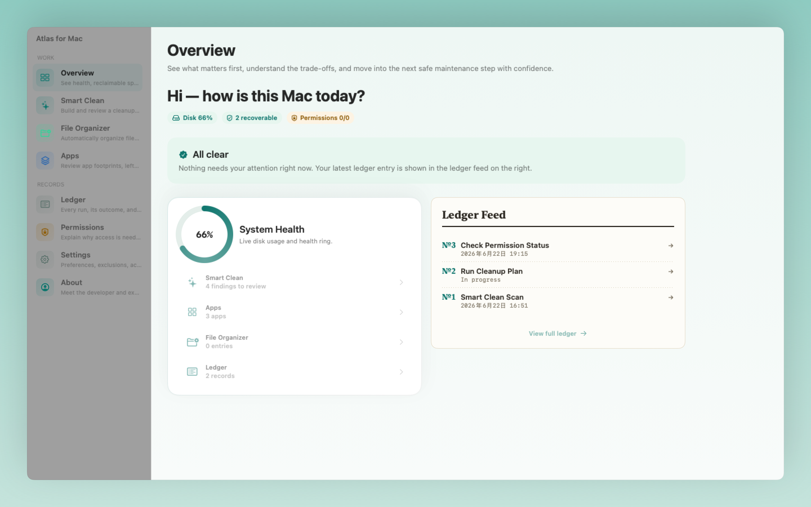
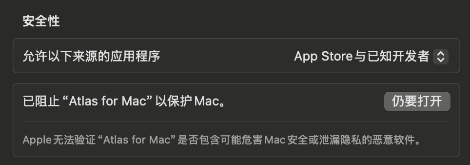
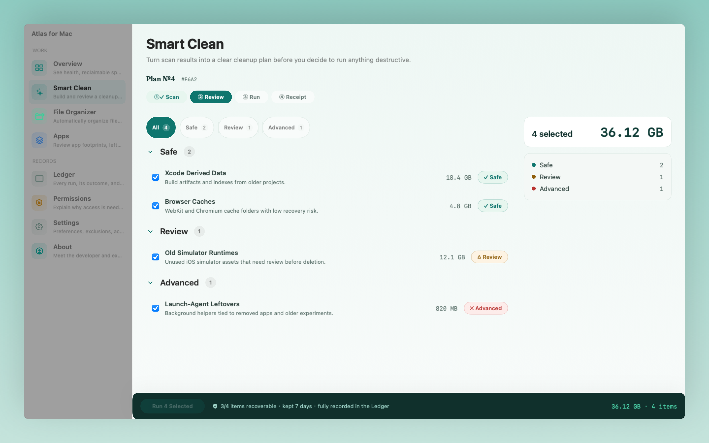
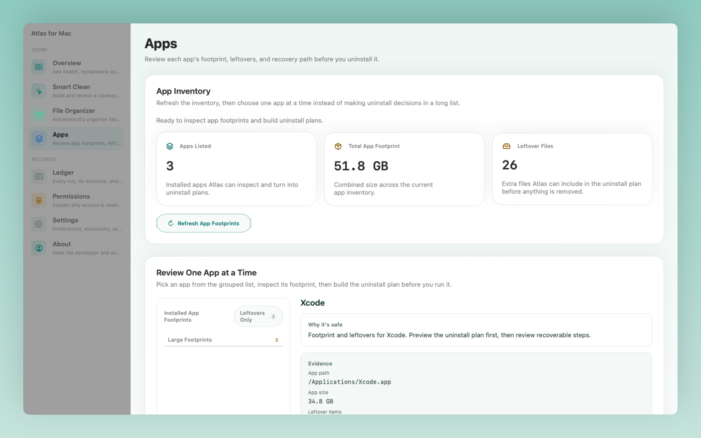
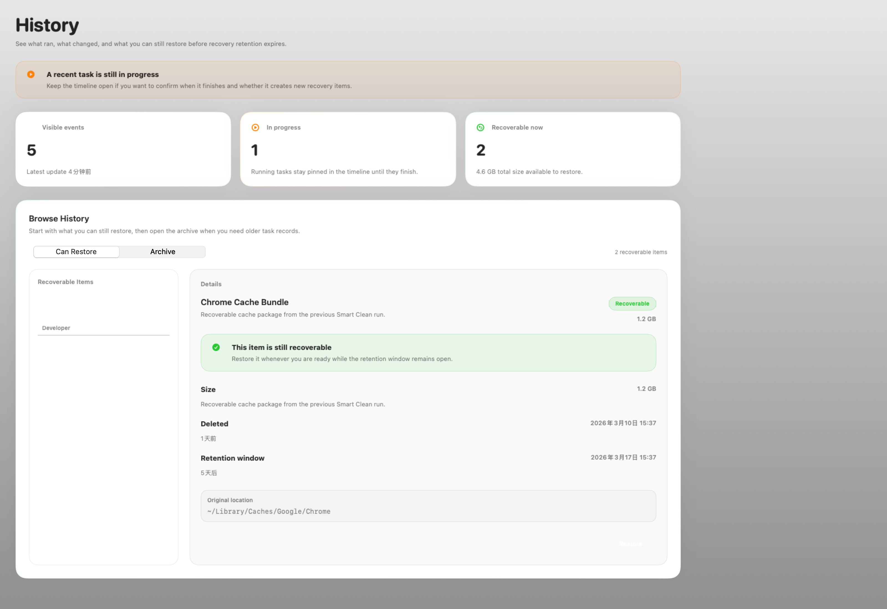

<div align="center">
  
  <h1>Atlas for Mac</h1>
  <p><em>可解释、以恢复为先的 Mac 维护工作台。</em></p>
</div>

<p align="center">
  <a href="README.md">English</a> | <strong>简体中文</strong>
</p>

<p align="center">
  
</p>

Atlas for Mac 是一款原生 macOS 应用，面向需要弄清楚 Mac 为什么变慢、磁盘为什么变满、系统为什么变得杂乱的用户，并在此基础上提供安全、可恢复的处理操作。当前 MVP 将系统概览、Smart Clean、应用卸载流程、权限指引、历史记录和恢复能力整合到一个桌面工作台中。

这个仓库是 Atlas for Mac 新产品的工作源码。Atlas for Mac 本身以 MIT License 开源发布。它是一个独立项目，可以在 MIT License 下复用部分上游 Mole 能力，但用户可见命名、发布材料和产品方向均以 Atlas 为主。

## 免责声明

Atlas for Mac 是一个独立的开源项目，与 Apple、Mole 上游作者或其他商业 Mac 工具厂商不存在隶属、赞助或背书关系。此仓库中的部分组件可能会在 MIT License 下复用或改造上游 Mole 代码；如果这些代码随产品一起发布，相关归因和第三方许可声明必须保留。清理、卸载和恢复类操作可能影响本地文件、缓存和应用数据，因此在执行前请先检查发现结果和恢复选项。可恢复操作仍会在 Atlas 中保留可追溯记录，但只有具备受支持恢复路径的项目，才支持磁盘级恢复。

## 安装

### 下载

请从 [Releases](https://github.com/CSZHK/CleanMyPc/releases) 页面下载最新版本：

- **`.dmg`** - 推荐。打开磁盘镜像后，将 Atlas 拖入 Applications 文件夹。
- **`.zip`** - 解压后将 Atlas.app 移动到 Applications 文件夹。
- **`.pkg`** - 运行安装包，按向导完成安装。

如果你想要正常的公开安装路径，优先下载最新的非 `prerelease` 版本。GitHub 上的 `prerelease` 版本可能包含用于测试的开发签名构建，这类构建在首次启动时可能需要 `仍要打开` 或右键 `打开`。

如果你安装的是 `prerelease` 版本，macOS 可能会在 `系统设置 -> 隐私与安全性` 中显示类似下面的拦截提示：

<p align="center">
  
</p>

### 系统要求

- macOS 14.0（Sonoma）或更高版本
- Apple Silicon 或 Intel Mac

### 从源码构建

```bash
git clone https://github.com/CSZHK/CleanMyPc.git
cd CleanMyPc
swift run --package-path Apps AtlasApp
```

或者使用 Xcode 打开：

```bash
brew install xcodegen
xcodegen generate
open Atlas.xcodeproj
```

> **说明**：Atlas 的发布包可能是 `Developer ID 签名 + 公证` 的正式构建，也可能是开发预发布构建，具体取决于该次发布。如果你安装的是预发布版本或本地构建版本，macOS 在首次启动时可能要求你使用 `仍要打开` 或右键 `打开`。

## MVP 模块

- `Overview`
- `Smart Clean`
- `Apps`
- `History`
- `Recovery`
- `Permissions`
- `Settings`

## 产品原则

- 执行前先解释推荐原因。
- 优先提供可恢复的操作，而不是永久删除。
- 对恢复能力保持诚实：并非每个“可恢复”项目都能真正回到磁盘。
- 权限请求遵循最小权限并结合具体上下文。
- 保持原生 macOS 应用外壳，并明确 worker 与 helper 边界。
- 同时支持 `简体中文` 和 `English`，其中 `简体中文` 为应用默认语言。

## 界面截图

| Overview | Smart Clean |
| --- | --- |
|  |  |

| Apps | History |
| --- | --- |
|  |  |

## 仓库结构

- `Apps/` - macOS 应用 target 与面向应用层的入口
- `Packages/` - 共享的 domain、application、design system、protocol 和 feature packages
- `XPC/` - worker service targets
- `Helpers/` - 特权 helper targets
- `Testing/` - 共享测试支持与 UI 自动化复现 targets
- `Docs/` - 产品、架构、规划、归因和执行文档

## 本地开发

### 运行应用

```bash
swift run --package-path Apps AtlasApp
```

### 打开原生 Xcode 工程

```bash
xcodegen generate
open Atlas.xcodeproj
```

### 构建原生应用包

```bash
./scripts/atlas/build-native.sh
```

### 打包 `.zip`、`.dmg` 和 `.pkg` 产物

```bash
./scripts/atlas/ensure-local-signing-identity.sh
./scripts/atlas/package-native.sh
```

对于没有 Apple 发布证书的机器，建议先执行本地签名初始化。这样本地包和预发布开发包会带有稳定的开发签名，而不是退回到 ad hoc 打包。

### 运行聚焦测试

```bash
swift test --package-path Packages
swift test --package-path Apps
```

## 刷新 README 媒体资源

```bash
./scripts/atlas/export-readme-assets.sh
```

该脚本会将当前配置的应用图标和应用外壳截图导出到 `Docs/Media/README/`。

## 作者与联系

- 开发者：`Lizi KK`
- 身份：`前百度 & 阿里技术负责人 · atomstorm.ai 创始人`
- 官网：[AtomStorm Studio](https://studio.atomstorm.ai)
- X（Twitter）：[x.com/lizikk_zhu](https://x.com/lizikk_zhu)
- Discord：[discord.gg/aR2kF8Xman](https://discord.gg/aR2kF8Xman)
- GitHub 仓库：[CSZHK/CleanMyPc](https://github.com/CSZHK/CleanMyPc)
- 问题反馈：[github.com/CSZHK/CleanMyPc/issues](https://github.com/CSZHK/CleanMyPc/issues)
- 安全联系：`cszhk0310@gmail.com`，仅用于私下报告安全漏洞。详见 [SECURITY.md](SECURITY.md)。

### 更多社媒

| 微信公众号 | 小红书 |
| --- | --- |
|  |  |

## 归因

Atlas for Mac 是一个独立的、基于 MIT License 发布的开源项目。此仓库部分构建工作基于开源项目 [Mole](https://github.com/tw93/mole)（由 tw93 和贡献者维护），并且当前仍包含作为实现输入的上游 Mole 代码和适配器。如果发布中包含上游衍生代码，请保持 [Docs/ATTRIBUTION.md](Docs/ATTRIBUTION.md) 和 [Docs/THIRD_PARTY_NOTICES.md](Docs/THIRD_PARTY_NOTICES.md) 与实际交付产物同步。
